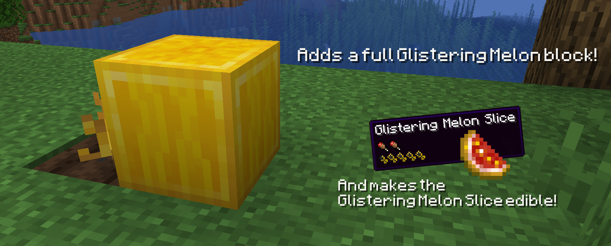
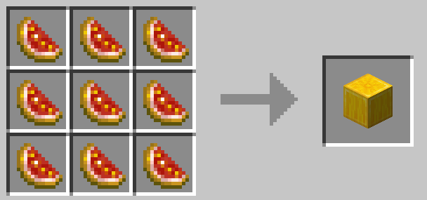
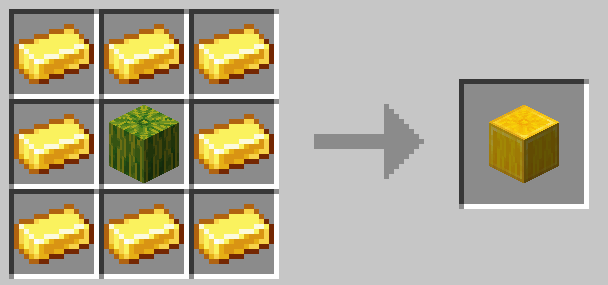
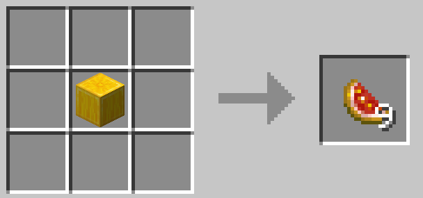

# Better Glistering Melons

In vanilla Minecraft, both Golden Apples and Golden Carrots can be eaten, but not Glistering Melon Slices! **Better Glistering Melons** addresses this grievous oversight by giving Glistering Melon Slices **2 nutrition** and **4.5 saturation**. This makes them great for restoring saturation, benefiting both your health regen and sprint stamina. 

Additionally, this mod adds a full **Glistering Melon** block. It can be crafted from 9 Glistering Melon Slices or by surrounding a standard Melon with 8 Gold Ingots in a crafting table. Unlike normal Melons, Glistering Melons must be **mined with a pickaxe** (they're gold-plated, after all), and the whole block is dropped rather than several slices. This means that Glistering Melons can be safely used as a storage block. 

Finally, there's a small chance (1/64) that a normal melon stem will **grow a Glistering Melon**!

## Recipes

### Glistering Melon

### Glistering Melon Slice

## Usage

- You're more than welcome to use this mod in any modpacks! 
- All of the original assets in this project are licensed under the GPL-3.0, so you're free to use them as you see fit, as long as you also open source any projects you release that include them
- Attribution is appreciated but not required

## Acknowledgements

- The idea for this mod came from Nekoma's ["I Fixed "USELESS" Minecraft Features"](https://www.youtube.com/watch?v=lYRpvjmH6Q8) video